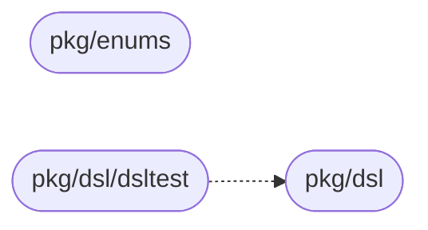

# CLAUDE.md

This file provides guidance to Claude Code when working with code in this repository.

## What This Repo Is

`workflow-models` is a **private Go shared library** (module: `github.com/BCBP-SOLUTIONS-FZC-LLC/workflow-models`, Go 1.26) — data types plus a few pure functions (`dsl.ExpandCalls`, `dsl.NodeKey`, `StageDef.CreatesHumanTask`); no runtime, never deployed as a server. It carries every type that crosses the boundary between `workflow-definition-service` (producer) and the Execution Service (consumer): the compiled-plan DSL and the shared enum/constant discriminators.

Scope rule: a type only one side reads or writes stays in that service's own domain package, not here. See `README.MD` § Scope boundary for the exact list of what's deliberately excluded (Execution's 18 outbound events, its 5 IAM-owned inbound payloads, `platform-events`' `Envelope[T]`).

Consuming services set `GOPRIVATE=github.com/BCBP-SOLUTIONS-FZC-LLC/*` and `go get github.com/BCBP-SOLUTIONS-FZC-LLC/workflow-models@vX.Y.Z` — never a local `replace` directive. Both `workflow-definition-service` and the Execution Service import it by direct reference: every caller imports `pkg/dsl`/`pkg/enums` directly, with no type alias indirection.

## Common Commands

```bash
make setup           # go mod download (no .env / runtime config — this module has none)
make tidy            # go mod tidy
make fmt             # go fmt ./...
make fmt-check       # verify gofmt formatting, no changes applied (what CI runs)
make vet             # go vet ./...
make lint            # go tool golangci-lint run
make vuln-check      # govulncheck on library packages
make mod-verify      # go mod verify
make test            # verbose test run
make test-ci         # race detector (what CI runs)
make build           # compile-check only — no cmd/ binary exists in this module
make ci              # tidy + vet + lint + test-ci + build — full local CI, run before pushing
make cover / cover-func   # coverage profile — see "Testing model" below
make godoc            # serve docs locally via pkgsite (http://localhost:8080)
make clean
```

## Architecture

Two packages with no edges between them, plus `pkg/dsl/dsltest`, which only tests import:



- `pkg/dsl` — the compiled-plan DSL (`CompiledCollaboration` → `CompiledPlan` → `DepartmentDef` → `StageDef` → `ExecutionPlan`/`ExecutionStep`) and `ExpandCalls`. Definition's BPMN compiler produces every field; Execution's workflow function consumes every field — the full contract, not a curated subset.
- `pkg/dsl/dsltest` — golden compiled collaborations, written by Definition's `TestGolden` and run by Execution's tests (LLD §2.7).
- `pkg/enums` — `StageDef.Type` discriminator values (`StageTypePrep`/`Review`/`Approve`/`SendTask`/`ReceiveTask`/`Connector`) and `AllowedBPMNElements`, the Tier-1 BPMN element allowlist.

Full field-by-field tables: `README.MD` § Package reference. Rationale/history for every shape decision: `ARCHITECTURE.md` (this repo) and the workflow-models LLD (`docs/lld/`, with its published copy in the design repo) — that LLD is the authoritative source; don't let this file or the README drift from it.

## Key Design Decisions

Condensed from the LLD's Appendix A — load that doc for the full rationale on any of these:

- **A shared Go module, not a hand-maintained JSON Schema or proto message.** The Go structs are the source of truth; a new field/element becomes a compile-time error the instant a consumer bumps the dependency. Proto was rejected specifically for `ExecutionStep` — a 7-way, recursive, variant-heavy union that would just become a second hand-synced source of truth.
- **`ExecutionStep` is mutually exclusive optional fields, not a tagged union** — which variant applies is just which field is non-nil, already expressed in Go's type system.
- **`Extras`/`IOMapping` unknown-key decode policy is asymmetric by prefix, not uniform** — an unrecognized `exec.`-prefixed key is routing/gating semantics a consumer predates and must hard-fail; any other unrecognized key is a Zeebe custom property that must soft-ignore.
- **Unknown `ExecutionStep` variant is a hard error; unknown `StageDef.Type` tolerates** — a missing control-flow discriminator is workflow corruption with no safe default; a new stage type is an intentional, forward-compat product surface.
- **A `json:"..."` tag change is always a MAJOR version bump** — Definition and Execution communicate over the JSON wire shape, not the Go struct/field name.
- **`platform-events`' `Envelope[T]` is not re-exported** — both services already import `platform-events` directly for it; re-exporting buys neither service anything neither can already reach.
- **Definition's migration is direct-reference, not a type alias** (revised from the LLD's original alias-based plan) — `internal/core/domain/compiled_plan.go` was deleted outright and every caller repoints at `pkg/dsl`/`pkg/enums`, trading a wider one-time diff (247 occurrences / 27 files) for zero indirection through `domain`. See LLD §8 and Appendix A #8.

## Testing model

`pkg/dsl` has a `roundtrip_test.go`: marshal a fixture → JSON → unmarshal → `reflect.DeepEqual` against the original — the drift tripwire. The test uses the black-box package name (`dsl_test`) and stays co-located with source (`pkg/dsl/roundtrip_test.go`), not moved to a `test/` tree — idiomatic Go, not the sibling libs' layout. `pkg/dsl/expand_test.go` covers `ExpandCalls` and `pkg/dsl/stage_test.go` covers `NodeKey` and `CreatesHumanTask`, the only executable code; everything else in `pkg/dsl` and `pkg/enums` is a declaration. No numeric coverage gate is wired into CI.

## Versioning and releases

See `VERSIONING.md` for the full SemVer policy and release process; `CHANGELOG.md` for per-version history. Tag and push triggers `release.yml` automatically; a tag with a `-` suffix (e.g. `v0.1.0-beta.1`) is a pre-release.

`ci.yml`/`release.yml` job names are shaped by an **org-wide branch-protection ruleset** requiring 7 named checks (`Build image (cache)`, `Lint Dockerfile`, `Trivy CVE scan`, `Smoke tests`, `Validate / Quality / quality`, `Validate / Test / test`, `PR summary`). This repo has no Dockerfile, no deployable image, and no runtime (pure types library — see the LLD's Repo Readiness Checklist for why a Dockerfile wasn't added), so `Build image (cache)`/`Lint Dockerfile`/`Smoke tests` are documented no-op placeholders in `ci.yml` (a local-replace "import as external consumer" smoke check was tried and dropped — it didn't test anything `Validate / Test` doesn't already cover); the other 4 are real. Request a Dockerfile-less-repo exemption from org admins when possible.

## See also

| Document | Description |
| --- | --- |
| `README.MD` | Scope, quick start, full package-reference field tables |
| `ARCHITECTURE.md` | Package dependency graph, testing model, key invariants |
| `VERSIONING.md` | SemVer rules, supported versions, release process |
| `CHANGELOG.md` | Per-version changes |
| `CONTRIBUTING.md` | Development setup, PR checklist |
| `SECURITY.md` | Vulnerability reporting, trust model |
| The workflow-models LLD (`docs/lld/workflow_models_lib.md`, published in the design repo) | Full field-by-field design rationale — the authoritative source for everything above |
