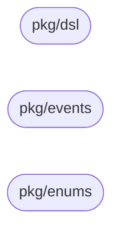

# Architecture

`workflow-models` is a shared Go module, not a service — it has no layers,
no adapters, and no runtime of its own. This document describes the shape
of its three packages, how they relate to each other, and how the two
consuming services (Definition and Execution) use them. For the full
field-level design rationale, see the design doc:
`design/LLD/workflow_models_lib.md` (BCBP-SOLUTIONS-FZC-LLC/design repo).

## Produce/consume boundary

Unlike a layered service, this module's "architecture" is a producer/consumer
relationship across a service boundary, not a dependency direction within
one codebase:

- **workflow-definition-service** *produces* every field in `pkg/dsl` (via
  its BPMN compiler) and every payload in `pkg/events`.
- **The future Execution Service** *consumes* both, entirely — it drives its
  workflow function off `pkg/dsl` and refreshes its compiled-plan cache off
  `pkg/events.TemplatePublishedPayload`.

The module holds only what both sides actually need — a type only one
service reads or writes stays in that service's own domain package, not
here (design doc §5).

## Package dependency graph

Verified by inspection: none of the three packages imports another.

Three disconnected nodes, zero edges — by design. Nothing in this module
depends on anything else in this module.

## Public API packages

### `pkg/dsl`

The compiled-plan DSL: `CompiledCollaboration` (root) → `CompiledPlan` (one
per BPMN pool) → `DepartmentDef` (one per lane) → `StageDef` (one per task)
→ `ExecutionPlan`/`ExecutionStep` (control flow). See design doc §2 for the
full field-by-field reference.

| Type | Role |
|------|------|
| `CompiledCollaboration` | Root artifact — main pool, every compiled pool, inter-pool messages |
| `CompiledPlan` | One compiled BPMN pool |
| `DepartmentDef` | One compiled BPMN lane |
| `StageDef` | One compiled task/stage |
| `ExecutionPlan` / `ExecutionStep` | The step sequence driving the workflow function |
| `ParallelBranch`, `ExclusiveBranch`, `SubWorkflowStep`, `CallPoolStep` | `ExecutionStep` variants |
| `IOMapping`, `IOVar`, `MessagePath`, `ErrorPath`, `TimerPath` | Supporting types for boundary events and variable mapping |

### `pkg/events`

Exactly one struct: `TemplatePublishedPayload` — the payload of
`workflow.template.published`, the only event that crosses the
Definition↔Execution boundary (design doc §3).

### `pkg/enums`

Five `StageType` constants (`prep`/`review`/`approve`/`send_task`/`receive_task`)
plus `EventTypeTemplatePublished`, the one shared wire-type string
(design doc §4).

## Testing model

Each package with executable content (`pkg/dsl`, `pkg/events`) has a
`roundtrip_test.go`: marshal a fixture → JSON → unmarshal → `reflect.DeepEqual`
against the original. This is the drift tripwire — it fails the moment a
struct or JSON tag changes shape without the fixture being updated
(design doc §9). `pkg/enums` has no test file; it holds only constants.

## Coverage note

`pkg/dsl`, `pkg/enums`, and `pkg/events` are pure struct/const declarations
today — zero executable statements. `go test -cover` correctly reports
"no statements" / 0.0%. No numeric coverage gate is wired into CI for this
reason (see `Makefile`'s `cover-func` target and `.github/workflows/ci.yml`) —
a gate would fail permanently regardless of test quality. Revisit once real
logic exists (e.g. the `Extras`/`IOMapping` `exec.`-prefix validator planned
in design doc §7/§11).

## Key invariants

| Invariant | Why it matters |
|-----------|-----------------|
| `Extras`/`IOMapping` unknown-key decode policy is asymmetric by prefix | An unrecognized `exec.`-prefixed key is routing/gating semantics a consumer predates and must hard-fail; any other unrecognized key is a Zeebe custom property that must soft-ignore (design doc Appendix A #9). |
| Unknown `ExecutionStep` variant is a hard error; unknown `StageDef.Type` tolerates | A missing control-flow discriminator is workflow corruption with no safe default. A new stage type beyond `prep`/`review`/`approve` is an intentional, forward-compat product surface (design doc Appendix A #10). |
| A `json:"..."` tag change is a MAJOR version bump | Definition and Execution communicate over the JSON wire shape, not the Go struct/field name — see [VERSIONING.md](./VERSIONING.md). |

## Documentation

Browse generated godoc locally with `make godoc` (serves via pkgsite at
`http://localhost:8080`). No separate mermaid-diagram asset pipeline is
needed given how small the dependency graph above is.
