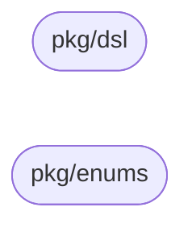

# Architecture

`workflow-models` is a shared Go module, not a service — it has no layers,
no adapters, and no runtime of its own. This document describes the shape
of its two packages (plus `pkg/dsl/dsltest`, golden plans for tests), how they relate to each other, and how the two
consuming services (Definition and Execution) use them. For the full
field-level design rationale, see the design doc `workflow_models_lib.md`
(also kept in-repo at `docs/lld/workflow_models_lib.md`, content-identical
to the design repo's published copy).

## Produce/consume boundary

Unlike a layered service, this module's "architecture" is a producer/consumer
relationship across a service boundary, not a dependency direction within
one codebase:

- **workflow-definition-service** *produces* every field in `pkg/dsl` via
  its BPMN compiler.
- **The Execution Service** *consumes* it entirely — it drives its workflow
  function off `pkg/dsl`.

The module holds only what both sides actually need — a type only one
service reads or writes stays in that service's own domain package, not
here (design doc §5).

## Package dependency graph

Verified by inspection: neither package imports the other.

Two disconnected nodes, zero edges — by design. Nothing in this module
depends on anything else in this module.

## Public API packages

### `pkg/dsl`

The compiled-plan DSL: `CompiledCollaboration` (root) → `CompiledPlan` (one
per process that runs: the workflow's and each module's) → `DepartmentDef` (one per lane segment) → `StageDef` (one per task)
→ `ExecutionPlan`/`ExecutionStep` (control flow). See design doc §2 for the
full field-by-field reference.

| Type | Role |
|------|------|
| `CompiledCollaboration` | Root artifact — the main plan and each module plan it calls |
| `CompiledPlan` | One compiled BPMN process |
| `DepartmentDef` | One stretch of a BPMN lane on one path |
| `StageDef` | One compiled task/stage |
| `ExecutionPlan` / `ExecutionStep` | The step sequence driving the workflow function |
| `ParallelBranch`, `ExclusiveBranch`, `SubWorkflowStep`, `CallPlanStep` | `ExecutionStep` variants |
| `ExpandCalls` | Turns every `CallPlanStep` into a `SubWorkflowStep` with call-scoped departments, shared so both services derive the same node keys |
| `NodeKey`, `StageDef.CreatesHumanTask` | A stage's key in both services, and whether it gets an assignee |
| `IOMapping`, `IOVar`, `MessagePath`, `ErrorPath`, `TimerPath` | Supporting types for boundary events and variable mapping |

### `pkg/enums`

Six `StageType` constants (`prep`/`review`/`approve`/`send_task`/`receive_task`/`connector`)
and `AllowedBPMNElements` — the shared Tier-1 BPMN element allowlist Definition
Service's compiler enforces and its modeler-facing discovery endpoint serves
(design doc §4, `definition_service.md` §4.1.2/§3.3.20).

## Testing model

`pkg/dsl` has a `roundtrip_test.go`: marshal a fixture → JSON → unmarshal →
`reflect.DeepEqual` against the original. This is the drift tripwire — it
fails the moment a struct or JSON tag changes shape without the fixture
being updated (design doc §9). `pkg/enums` has no test file; it holds only
constants.

`pkg/dsl/dsltest` ships golden compiled plans that Definition's publish
produces and Execution's tests run (design doc §2.7). Definition's golden test
writes them and fails when its output changes; `dsltest_test.go` pins what
consumers rely on after `ExpandCalls`. Never edit a golden by hand.

## Coverage note

`pkg/dsl`'s executable code is `ExpandCalls` (`expand.go`), tested by
`expand_test.go`, and `NodeKey`/`CreatesHumanTask` (`stage.go`), tested by
`stage_test.go`; everything else in `pkg/dsl` and `pkg/enums` is a
declaration. No numeric coverage gate is wired into CI (see `Makefile`'s
`cover-func` target and `.github/workflows/ci.yml`).

## Key invariants

| Invariant | Why it matters |
|-----------|-----------------|
| `Extras`/`IOMapping` unknown-key decode policy is asymmetric by prefix | An unrecognized `exec.`-prefixed key is routing/gating semantics a consumer predates and must hard-fail; any other unrecognized key is a Zeebe custom property that must soft-ignore (design doc Appendix A #9). |
| Unknown `ExecutionStep` variant is a hard error; unknown `StageDef.Type` tolerates | A missing control-flow discriminator is workflow corruption with no safe default. A new stage type beyond `prep`/`review`/`approve` is an intentional, forward-compat product surface (design doc Appendix A #10). |
| A `json:"..."` tag change is a MAJOR version bump | Definition and Execution communicate over the JSON wire shape, not the Go struct/field name — see [VERSIONING.md](./VERSIONING.md). |

## Documentation

Browse generated godoc locally with `make godoc` (serves via pkgsite at
`http://localhost:8080`). No separate mermaid-diagram asset pipeline is
needed given how small the dependency graph above is.
