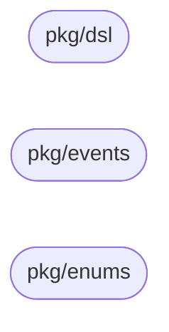

# workflow-models

Shared Go module between Definition Service and Execution Service; every type crossing that service boundary lives here once, instead of being hand-mirrored independently on each side.

## Scope

- `pkg/dsl` — the compiled-plan DSL. Definition's BPMN compiler produces every field; Execution's workflow function consumes every field — the full contract, not a curated subset.
- `pkg/events` — exactly one struct, `TemplatePublishedPayload` (`workflow.template.published`), the only event payload that crosses this boundary.
- `pkg/enums` — `StageDef.Type` discriminator values plus the one shared event's wire-type constant.

A type only one side reads or writes stays in that service's own domain package, not here.

## Contents

- [workflow-models](#workflow-models)
  - [Scope](#scope)
  - [Contents](#contents)
  - [Package dependency graph](#package-dependency-graph)
  - [Scope boundary](#scope-boundary)
  - [Adding to a consumer service](#adding-to-a-consumer-service)
  - [Quick start — pkg/dsl](#quick-start--pkgdsl)
  - [Quick start — pkg/events](#quick-start--pkgevents)
  - [Package reference — pkg/dsl](#package-reference--pkgdsl)
  - [Package reference — pkg/events](#package-reference--pkgevents)
  - [Package reference — pkg/enums](#package-reference--pkgenums)
  - [Key invariants](#key-invariants)
  - [Testing model](#testing-model)
  - [Versioning and releases](#versioning-and-releases)
  - [See also](#see-also)

## Package dependency graph

None of the three packages imports another:



## Scope boundary

- `internal/core/domain/compiled_plan.go` and `eventpayloads.go` in `workflow-definition-service` define the same types as `pkg/dsl`/`pkg/events` (`CompiledCollaboration`, `CompiledPlan`, `DepartmentDef`, `StageDef`, `ExecutionPlan`/`ExecutionStep` and its branch/step variants, `MessageDef`, `TemplatePublishedPayload`, `EventTypeTemplatePublished`) — see [VERSIONING.md](./VERSIONING.md) and the design doc (§8) for the type-alias consolidation this module is the target of.
- Execution's 18 outbound events (`workflow.instance.*`, `workflow.task.*` — e.g. `workflow.instance.paused`, `workflow.task.reassigned`, `workflow.task.sla-breached`) belong to Execution's own domain package; consumers are Audit, Notification, Tender, LLM, and the Dashboard Stream Gateway, not Definition.
- The 5 IAM-owned inbound events Execution decodes — `DelegationStarted`, `DelegationEnded`, `TenantStateChanged`, `UserDeleted`, `UserAvailabilityChanged` — and their enum values (`initiator`, tenant `status`, delegation `scope`/`ended_reason`, force-route `direction`) live in Execution's own domain package.
- `platform-events`' `Envelope[T]` is not re-exported here — both services import `platform-events` directly for it.

## Adding to a consumer service

This is a **private module**:

```bash
go env -w GOPRIVATE=github.com/BCBP-SOLUTIONS-FZC-LLC/*
```

```bash
go get github.com/BCBP-SOLUTIONS-FZC-LLC/workflow-models@vX.Y.Z
go mod tidy
go mod vendor   # if the consuming service vendors dependencies
```

Never add a local `replace` directive pointing at a filesystem path — always consume a tagged version.

## Quick start — pkg/dsl

```go
import "github.com/BCBP-SOLUTIONS-FZC-LLC/workflow-models/pkg/dsl"

plan := &dsl.CompiledCollaboration{
    MainPlan: "Bid-No-Bid Review",
    Plans: []*dsl.CompiledPlan{
        {
            Name: "Bid-No-Bid Review",
            Departments: []dsl.DepartmentDef{
                {
                    ID:    "Bid-No-Bid Review/Tender Business",
                    Label: "Tender Business",
                    Stages: []dsl.StageDef{
                        {
                            Type:     "receive_task", // enums.StageTypeReceiveTask
                            Activity: "RFQ received",
                            Role:     "tender-business",
                            BoundaryTimer: &dsl.BoundaryTimer{
                                Duration:     "72h",
                                Interrupting: true,
                            },
                        },
                    },
                },
            },
            Execution: dsl.ExecutionPlan{
                Steps: []dsl.ExecutionStep{
                    {Sequential: []string{"Bid-No-Bid Review/Tender Business"}},
                },
            },
        },
    },
}

b, err := json.Marshal(plan)
// ...
var decoded dsl.CompiledCollaboration
err = json.Unmarshal(b, &decoded)
```

`StageDef.Type` is a plain `string` field, not `enums.StageType` — populate it with an `enums.StageType*` constant's value (`enums.StageTypeReceiveTask`) or the equivalent raw string.

## Quick start — pkg/events

Fresh publish (no promotion):

```go
import "github.com/BCBP-SOLUTIONS-FZC-LLC/workflow-models/pkg/events"

payload := events.TemplatePublishedPayload{
    WorkflowID:    "018e1f2a-0000-7000-8000-000000000001",
    WorkflowKey:   "bid-no-bid-review",
    VersionID:     "018e1f2a-0000-7000-8000-000000000002",
    VersionNumber: 1,
    ArtifactHash:  "sha256:deadbeef",
    PublishedBy:   "018e1f2a-0000-7000-8000-000000000003",
}
```

Promotion of an existing version — `PromotedFromVersionID` set:

```go
promotedFrom := "018e1f2a-0000-7000-8000-000000000009"
payload := events.TemplatePublishedPayload{
    WorkflowID:            "018e1f2a-0000-7000-8000-000000000001",
    WorkflowKey:           "bid-no-bid-review",
    VersionID:             "018e1f2a-0000-7000-8000-000000000002",
    VersionNumber:         3,
    ArtifactHash:          "sha256:deadbeef",
    PublishedBy:           "018e1f2a-0000-7000-8000-000000000003",
    PromotedFromVersionID: &promotedFrom,
}
```

`PromotedFromVersionID` is `omitempty` — a nil pointer is simply absent from the marshaled JSON.

## Package reference — pkg/dsl

```text
CompiledCollaboration                 (root artifact)
 ├─ Plans   []*CompiledPlan
 │            ├─ Departments []DepartmentDef
 │            │                ├─ Stages []StageDef
 │            │                │            ├─ BoundaryTimer  *BoundaryTimer
 │            │                │            └─ BoundaryMessage *MessagePath
 │            │                └─ (props map)
 │            ├─ Execution ExecutionPlan
 │            │              └─ Steps []ExecutionStep
 │            │                         ├─ Parallel  []ParallelBranch      → Steps []ExecutionStep (recursive)
 │            │                         ├─ Exclusive []ExclusiveBranch
 │            │                         ├─ SubWorkflow *SubWorkflowStep
 │            │                         │                ├─ Plan ExecutionPlan (recursive)
 │            │                         │                ├─ ErrorPaths []ErrorPath
 │            │                         │                ├─ TimerPaths []TimerPath
 │            │                         │                └─ MessagePaths []MessagePath
 │            │                         ├─ CallPool  *CallPoolStep
 │            │                         ├─ IOMapping *IOMapping → Inputs/Outputs []IOVar
 │            │                         └─ MessagePaths []MessagePath
 │            └─ VisualElements []VisualElementDef
 └─ Messages []MessageDef
```

`ExecutionStep` is a struct of mutually exclusive optional fields, not a tagged union — which variant applies is just which field is non-nil.

| Type | Fields |
| --- | --- |
| `CompiledCollaboration` | `MainPlan string`, `Plans []*CompiledPlan`, `Messages []MessageDef` |
| `MessageDef` | `Name`, `SourcePlan`, `TargetPlan` |
| `CompiledPlan` | `Name`, `TaskQueue string,omitempty`, `Ignored bool,omitempty`, `Departments []DepartmentDef`, `Execution ExecutionPlan`, `VisualElements []VisualElementDef,omitempty` |
| `VisualElementDef` | `Kind`, `ID`, `Name,omitempty` |
| `DepartmentDef` | `ID`, `Label`, `IAMDepartmentID string,omitempty`, `Ignore bool,omitempty`, `Props map[string]string,omitempty`, `Stages []StageDef` |
| `StageDef` | `Type string` (holds `enums.StageType*` values), `Activity`, `NodeID,omitempty`, `Role`, `DefaultAssignees []string,omitempty`, `DueDate,omitempty`, `FollowUpDate,omitempty`, `BoundaryTimer *BoundaryTimer,omitempty`, `BoundaryMessage *MessagePath,omitempty`, `EngineNote,omitempty`, `Extras map[string]string,omitempty`, `IsZeebeUserTask bool,omitempty` |
| `BoundaryTimer` | `Duration`, `Interrupting bool`, `TargetDept,omitempty` |
| `ExecutionPlan` | `Steps []ExecutionStep` |
| `ExecutionStep` | `Sequential []string,omitempty`, `Parallel []ParallelBranch,omitempty`, `Exclusive []ExclusiveBranch,omitempty`, `SubWorkflow *SubWorkflowStep,omitempty`, `CallPool *CallPoolStep,omitempty`, `IOMapping *IOMapping,omitempty`, `Extras map[string]string,omitempty`, `MessagePaths []MessagePath,omitempty` |
| `MessagePath` | `MessageName`, `Interrupting bool`, `TargetDept,omitempty` |
| `IOMapping` | `Inputs []IOVar,omitempty`, `Outputs []IOVar,omitempty` |
| `IOVar` | `Source`, `Target` |
| `ParallelBranch` | `DeptID`, `Steps []ExecutionStep` (recursive) |
| `ExclusiveBranch` | `Target,omitempty`, `TargetStage,omitempty`, `TargetNodeID,omitempty`, `TargetName,omitempty`, `ConditionExpression` (no omitempty), `Terminates bool,omitempty`, `RevertToDept/RevertToStage/RevertToNodeID/RevertToName,omitempty` |
| `SubWorkflowStep` | `NodeID,omitempty`, `Name`, `Plan ExecutionPlan` (recursive), `ErrorPaths []ErrorPath,omitempty`, `TimerPaths []TimerPath,omitempty`, `MessagePaths []MessagePath,omitempty` |
| `ErrorPath` | `ErrorCode,omitempty`, `ShortCircuit bool` (no omitempty), `TargetDept,omitempty` |
| `TimerPath` | `Duration`, `Interrupting bool`, `TargetDept,omitempty` |
| `CallPoolStep` | `Pool` |

## Package reference — pkg/events

| Field | Type | JSON tag |
| --- | --- | --- |
| `WorkflowID` | `string` | `workflow_id` |
| `WorkflowKey` | `string` | `workflow_key` |
| `VersionID` | `string` | `version_id` |
| `VersionNumber` | `int32` | `version_number` |
| `ArtifactHash` | `string` | `artifact_hash` |
| `PublishedBy` | `string` | `published_by` |
| `PromotedFromVersionID` | `*string` | `promoted_from_version_id,omitempty` |

`pkg/events` holds exactly this one struct. Execution's 18 outbound event payloads are consumed by Audit, Notification, Tender, LLM, and the Dashboard Stream Gateway — never by Definition — so they stay in Execution's own domain package rather than here.

## Package reference — pkg/enums

| Constant | Value |
| --- | --- |
| `StageTypePrep` | `"prep"` |
| `StageTypeReview` | `"review"` |
| `StageTypeApprove` | `"approve"` |
| `StageTypeSendTask` | `"send_task"` |
| `StageTypeReceiveTask` | `"receive_task"` |
| `EventTypeTemplatePublished` | `"workflow.template.published"` |

An unrecognized `StageDef.Type` value is a valid forward-compat passthrough, not membership in a closed set — the compiler emits `UNKNOWN_STAGE_TYPE` as a warning, not an error, and compiles a passthrough `StageDef`.

## Key invariants

| Invariant | Why it matters |
| --- | --- |
| `Extras`/`IOMapping` unknown-key decode policy is asymmetric by prefix | An unrecognized `exec.`-prefixed key is routing/gating semantics a consumer predates and must hard-fail; any other unrecognized key is a Zeebe custom property that must soft-ignore. |
| Unknown `ExecutionStep` variant is a hard error; unknown `StageDef.Type` tolerates | A missing control-flow discriminator is workflow corruption with no safe default. A new stage type beyond `prep`/`review`/`approve` is an intentional, forward-compat product surface. |
| A `json:"..."` tag change is a MAJOR version bump | Definition and Execution communicate over the JSON wire shape, not the Go struct/field name. |

## Testing model

Each package with executable content (`pkg/dsl`, `pkg/events`) has a `roundtrip_test.go`: marshal a fixture → JSON → unmarshal → `reflect.DeepEqual` against the original — the drift tripwire. `pkg/dsl`, `pkg/enums`, and `pkg/events` are pure struct/const declarations with zero executable statements, so `go test -cover` reports 0% and no numeric coverage gate is wired into CI for this package.

## Versioning and releases

See [VERSIONING.md](./VERSIONING.md) for the full release process. Summary:

| Version bump | When |
| --- | --- |
| **MAJOR** | Breaking/renamed exported field in `pkg/dsl`, `pkg/events`, or `pkg/enums`; a wire-format (JSON tag) change |
| **MINOR** | New backward-compatible field, `StageType`, or event-type constant |
| **PATCH** | Doc-only correction, internal test fixture update |

```bash
# Tag and push triggers the release workflow automatically.
git tag -a v1.0.0 -m "v1.0.0"
git push origin v1.0.0
```

## See also

| Document | Description |
| --- | --- |
| [ARCHITECTURE.md](./ARCHITECTURE.md) | Package dependency graph, testing model, key invariants |
| [VERSIONING.md](./VERSIONING.md) | SemVer rules, supported versions, release process |
| [CHANGELOG.md](./CHANGELOG.md) | Per-version changes |
| [CONTRIBUTING.md](./CONTRIBUTING.md) | Development setup, PR checklist |
| [SECURITY.md](./SECURITY.md) | Vulnerability reporting, trust model |
